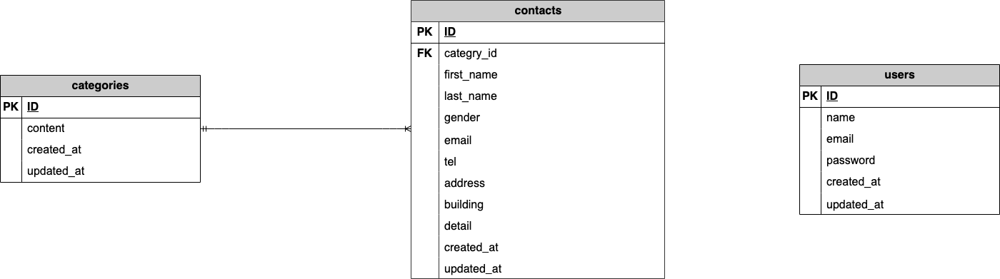

# アプリケーション名

**FashionablyLateのお問い合わせフォーム**
ユーザーからのお問い合わせを受け付け、内容をデータベースに保存するシンプルなお問い合わせ管理アプリケーションです。

# アプリの機能概要

本アプリケーションでは、ユーザーからのお問い合わせを受け付けるための以下 3 画面を実装しています。

## お問い合わせフォーム

ユーザーが以下の情報を入力します。

- お名前（必須・姓/名）
- 性別（必須：1=男性 / 2=女性 / 3=その他）
- 電話番号（必須・3分割）
- 電話番号（必須）
- 住所（必須）
- 建物名（任意）
- お問い合わせの種類（必須・categories テーブルから取得）
- お問い合わせ内容（必須・120文字以内）

## お問い合わせ確認画面

入力内容を確認し、
「送信」 または 「修正」 を選択できます。

- **修正** → 入力画面に戻り、入力値を保持したまま編集可能
- **送信** → DB に保存し、サンクスページへ遷移

のいずれかを選択できます。

## サンクスページ

お問い合わせ内容が contacts テーブルに保存された後、
ユーザーに送信完了を知らせるページを表示します。

---

# 画面設計（URL 設計）

| 画面     | URL         | HTTP | 説明                 |
| -------- | ----------- | ---- | -------------------- |
| 入力画面 | `/`         | GET  | お問い合わせフォーム |
| 確認画面 | `/confirm`  | POST | 入力内容の確認       |
| 保存処理 | `/contacts` | POST | DB 保存処理          |
| 完了画面 | `/thanks`   | GET  | 送信完了             |

---

# バリデーション仕様（FormRequest）

| 項目               | ルール                    |
| ------------------ | ------------------------- |
| 姓                 | 必須・最大 8 文字         |
| 名                 | 必須・最大 8 文字         |
| 性別               | 必須                      |
| メールアドレス     | 必須・メール形式          |
| 電話番号（3 分割） | 必須・半角数字・最大 5 桁 |
| 住所               | 必須                      |
| 建物名             | 任意                      |
| お問い合わせの種類 | 必須                      |
| お問い合わせ内容   | 必須・最大 120 文字       |

---

# テーブル仕様書

## contacts テーブル

| カラム名    | 型              | 必須 | 備考                   |
| ----------- | --------------- | ---- | ---------------------- |
| id          | bigint unsigned | ○    | PK                     |
| category_id | bigint unsigned | ○    | FK（categories.id）    |
| last_name   | varchar(255)    | ○    |                        |
| first_name  | varchar(255)    | ○    |                        |
| gender      | tinyint         | ○    | 1=男性,2=女性,3=その他 |
| email       | varchar(255)    | ○    |                        |
| tel         | varchar(255)    | ○    | 3 分割を結合して保存   |
| address     | varchar(255)    | ○    |                        |
| building    | varchar(255)    |      | 任意                   |
| detail      | text            | ○    |                        |
| created_at  | timestamp       |      |                        |
| updated_at  | timestamp       |      |                        |

## categories テーブル

| カラム名   | 型              | 必須 |
| ---------- | --------------- | ---- |
| id         | bigint unsigned | ○    |
| content    | varchar(255)    | ○    |
| created_at | timestamp       |      |
| updated_at | timestamp       |      |

---

# ダミーデータ作成

```bash

php artisan db:seed

```

# 環境構築

## 1. Docker ビルド

```

git clone git@github.com:taeko-yanari/test_contact-form.git
docker-compose up -d --build

```

## 2. Laravel 環境構築

```

docker-compose exec php bash
composer install
cp .env.example .env
php artisan key:generate
php artisan migrate
php artisan db:seed

```

# 使用技術

- PHP 8.1（Docker）
- Laravel 8.83.29
- MySQL 8.0.26（Docker）
- nginx 1.21.1（Docker）

# URL

- お問い合わせ画面：http://localhost/
- phpMyAdmin：http://localhost:8080/

## ER図


